Régression sur des Données Compositionnelles
================
Enora Belz & Arthur Charpentier

true

``` r
library(readxl)
library(dplyr)
library(stringr)
library(spdep)
library(raster)
library(maptools)
library(compositions)
library(classInt)
library(RColorBrewer)
library(ineq)
library(sp)
library(ggplot2)
library(tidyr)
```

# Lecture des donnees

``` r
#Revenu
Revenu <- read_excel("REVENU_DEC_IRIS_2014_INSEE.xls",sheet=1,skip=5)
Revenu$DEP = str_sub(Revenu$COM,0,2)
Revenu <- Revenu %>% filter(DEP=="75")
Revenu$IRIS=as.integer(Revenu$IRIS)
Revenu$COM=as.integer(Revenu$COM)
Revenu$T_Impot = Revenu$DEC_PIMP14
Revenu$T_Pauv = Revenu$DEC_TP6014
Revenu$Mediane = Revenu$DEC_MED14
R_etude = Revenu %>% dplyr::select(IRIS,COM,LIBIRIS,LIBCOM,T_Impot,T_Pauv,Mediane)
```

``` r
#Activite
Activite <- read.csv2("ACTIVITE_IRIS_2014_INSEE.csv",skip=5)
Activite$DEP = as.integer(Activite$DEP)
Activite <- Activite %>% filter(DEP==75)
Activite$IRIS=as.integer(Activite$IRIS)
Activite$COM=as.integer(Activite$COM)
Activite$Pop1564 = Activite$P14_POP1564
Activite$Actif1564 = Activite$P14_ACT1564   
Activite$Actif1564H = Activite$P14_HACT1564 
Activite$Actif1564F = Activite$P14_FACT1564
Activite$Actif1564OCC = Activite$P14_ACTOCC1564 
Activite$Actif1564OCCH = Activite$P14_HACTOCC1564   
Activite$Actif1564OCCF = Activite$P14_FACTOCC1564
Activite$Chom1564 = Activite$P14_CHOM1564   
Activite$Inactif1564 = Activite$P14_INACT1564   
Activite$Retr1564 = Activite$P14_RETR1564   
Activite$Autreinactif1564 = Activite$P14_AINACT1564 
A_etude = Activite %>% dplyr::select(IRIS,COM,LIBIRIS,LIBCOM,Pop1564,Actif1564,Actif1564H,Actif1564F,Actif1564OCC,Actif1564OCCH,Actif1564OCCF,Chom1564,Inactif1564,Retr1564,Autreinactif1564)
```

``` r
#Logement
Logement <- read.csv2("LOGEMENT_IRIS_2014_INSEE.csv",skip=5)
Logement$DEP = as.integer(as.character(Logement$DEP))
```

    ## Warning: NAs introduits lors de la conversion automatique

``` r
Logement <- Logement %>% filter(DEP==75)
Logement$IRIS=as.integer(as.character(Logement$IRIS))
Logement$COM=as.integer(as.character(Logement$COM))
Logement$Logement = Logement$P14_LOG 
Logement$ResidPrinc = Logement$P14_RP
Logement$Maison = Logement$P14_MAISON
Logement$Appart = Logement$P14_APPART
Logement$RP_Proprio = Logement$P14_RP_PROP
Logement$RP_Loca = Logement$P14_RP_LOC
Logement$RP_Grat = Logement$P14_RP_GRAT
Logement$RP0_40=(Logement$P14_RP_M30M2+Logement$P14_RP_3040M2)
Logement$RP40_100=(Logement$P14_RP_4060M2+Logement$P14_RP_6080M2+Logement$P14_RP_80100M2)
Logement$RP100_plus=(Logement$P14_RP_100120M2+Logement$P14_RP_120M2P)
Z=(Logement$RP0_40+Logement$RP40_100+Logement$RP100_plus)
Logement$RP0_40=Logement$RP0_40/Z
Logement$RP40_100=Logement$RP40_100/Z
Logement$RP100_plus=Logement$RP100_plus/Z
L_etude = Logement %>% dplyr::select(IRIS,COM,LIBIRIS,LIBCOM,Logement,ResidPrinc,Maison,Appart,RP_Proprio,RP_Loca,RP_Grat,RP0_40,RP40_100,RP100_plus)
```

``` r
#Formation
Formation <- read.csv2("DIPLOME_IRIS_2014_INSEE.csv",skip=5)
Formation$DEP = as.integer(as.character(Formation$DEP))
Formation <- Formation %>% filter(DEP==75)
Formation$IRIS=as.integer(as.character(Formation$IRIS))
Formation$COM=as.integer(as.character(Formation$COM))
Formation$DiplMin = Formation$P14_NSCOL15P_DIPLMIN
Formation$CAPBEP = Formation$P14_NSCOL15P_CAPBEP
Formation$BAC = Formation$P14_NSCOL15P_BAC  
Formation$SUP = Formation$P14_NSCOL15P_SUP  
Formation$Total_NSCOL = Formation$P14_NSCOL15P
F_etude = Formation %>% dplyr::select(IRIS,COM,LIBIRIS,LIBCOM,DiplMin,CAPBEP,BAC,SUP,Total_NSCOL)
```

``` r
#Population
Popul <- read.csv2("POPULATION_IRIS_2014_INSEE.csv",skip=5)
Popul$DEP = as.integer(as.character(Popul$DEP))
```

    ## Warning: NAs introduits lors de la conversion automatique

``` r
Popul <- Popul %>% filter(DEP==75)
Popul$IRIS=as.integer(as.character(Popul$IRIS))
Popul$COM=as.integer(as.character(Popul$COM))
Popul$Pop_Total = Popul$P14_POP 
Popul$Pop_0019 = Popul$P14_POP0019
Popul$Pop_2064 = Popul$P14_POP2064
Popul$Pop_65P = Popul$P14_POP65P
Popul$Pop_H = Popul$P14_POPH
Popul$Pop_F = Popul$P14_POPF
Popul$Pop_15P = Popul$C14_POP15P
Popul$Pop_15P_CS1 = Popul$C14_POP15P_CS1
Popul$Pop_15P_CS2 = Popul$C14_POP15P_CS2
Popul$Pop_15P_CS3 = Popul$C14_POP15P_CS3
Popul$Pop_15P_CS4 = Popul$C14_POP15P_CS4    
Popul$Pop_15P_CS5 = Popul$C14_POP15P_CS5    
Popul$Pop_15P_CS6 = Popul$C14_POP15P_CS6    
Popul$Pop_15P_CS7 = Popul$C14_POP15P_CS7
Popul$Pop_15P_CS8 = Popul$C14_POP15P_CS8
P_etude = Popul %>% dplyr::select(IRIS,COM,LIBIRIS,LIBCOM,Pop_Total,Pop_0019,Pop_2064,Pop_65P,Pop_H,Pop_F,Pop_15P,Pop_15P_CS1,Pop_15P_CS2,Pop_15P_CS3,Pop_15P_CS4,Pop_15P_CS5,Pop_15P_CS6,Pop_15P_CS7,Pop_15P_CS8)
```

``` r
# Fichier joint
df <- left_join(F_etude,R_etude)
```

    ## Joining, by = c("IRIS", "COM", "LIBIRIS", "LIBCOM")

    ## Warning: Column `LIBIRIS` joining factor and character vector, coercing
    ## into character vector

    ## Warning: Column `LIBCOM` joining factor and character vector, coercing into
    ## character vector

``` r
df <- left_join(df,L_etude)
```

    ## Joining, by = c("IRIS", "COM", "LIBIRIS", "LIBCOM")

    ## Warning: Column `LIBIRIS` joining character vector and factor, coercing
    ## into character vector

    ## Warning: Column `LIBCOM` joining character vector and factor, coercing into
    ## character vector

``` r
df <- left_join(df,A_etude)
```

    ## Joining, by = c("IRIS", "COM", "LIBIRIS", "LIBCOM")

    ## Warning: Column `LIBIRIS` joining character vector and factor, coercing
    ## into character vector
    
    ## Warning: Column `LIBCOM` joining character vector and factor, coercing into
    ## character vector

``` r
df <- left_join(df,P_etude)
```

    ## Joining, by = c("IRIS", "COM", "LIBIRIS", "LIBCOM")

    ## Warning: Column `LIBIRIS` joining character vector and factor, coercing
    ## into character vector
    
    ## Warning: Column `LIBCOM` joining character vector and factor, coercing into
    ## character vector

``` r
df <- df %>% mutate(CODE_IRIS=IRIS) %>% dplyr::select(-IRIS)
sum(df$DiplMin+df$CAPBEP)/sum(df$Total_NSCOL)
```

    ## [1] 0.2814028

``` r
sum(df$BAC)/sum(df$Total_NSCOL)
```

    ## [1] 0.1395244

``` r
sum(df$SUP)/sum(df$Total_NSCOL)
```

    ## [1] 0.5790765

``` r
df <-  df %>% 
  mutate(RP0_40=RP0_40,
         RP40_100=RP40_100,
         RP100_plus=RP100_plus,
         BEP=DiplMin+CAPBEP,
         BAC=BAC,
         SUP=SUP,)
df=df[df$Pop_Total>100,]
```

# Spatial

``` r
filename <- "CONTOURS-IRIS_D075.shp"
p <- shapefile(filename)
p_donnee = p  
p_donnee@data$CODE_IRIS <- as.integer(p_donnee@data$DCOMIRIS)
p_donnee@data<- left_join(p_donnee@data,df)
plot(p_donnee)
```

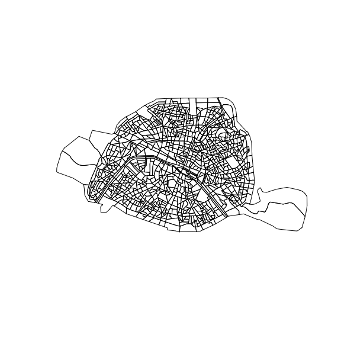<!-- -->

``` r
p_donnee@data = p_donnee@data %>% filter(!is.nan(RP0_40),!is.nan(RP40_100),!is.nan(RP100_plus),is.na(Mediane)==FALSE)
X2 <- acomp(clo(cbind(p_donnee@data$RP0_40,p_donnee@data$RP40_100,p_donnee@data$RP100_plus)))
X1 <- acomp(clo(cbind(p_donnee@data$BEP,p_donnee@data$BAC,p_donnee@data$SUP)))
Y = p_donnee@data$Mediane
X = X1
S = p_donnee@data$BAC+p_donnee@data$BEP+p_donnee@data$SUP
base=data.frame(REVENU=p_donnee@data$Mediane/1000,
BAC=p_donnee@data$BAC/S,
BEP=p_donnee@data$BEP/S,
SUP=p_donnee@data$SUP/S)
```

``` r
par(mar=c(1,1,0,1))
plot(X,labels=c("BAC","BEP","SUP"),axes=TRUE,lwd=2,
     col=gray.colors(length(Y))[rev(rank(Y))],cex=.4)
```

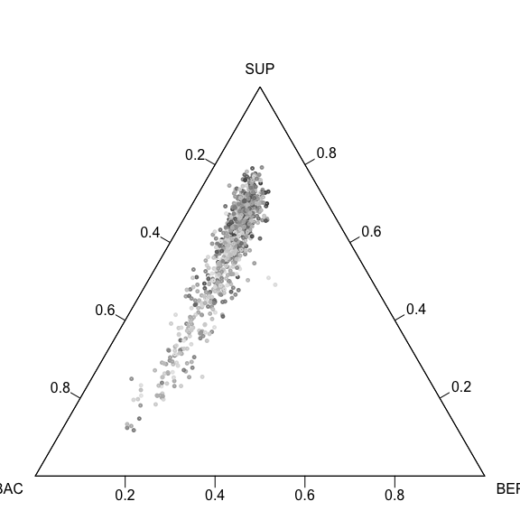<!-- -->

``` r
palette <- brewer.pal(n = 9, name = "YlOrRd")
classTemps <- classIntervals(p_donnee@data$Mediane/1000, 9, style = "quantile")
p_donnee@data$Mediane_cat <- as.character(cut(p_donnee@data$Mediane/1000, breaks = classTemps$brks, labels = palette, include.lowest = TRUE))
legende <- as.character(levels(cut(round(as.numeric(p_donnee@data$Mediane/1000),0), digit.lab=5,breaks = round(classTemps$brks,0), include.lowest = TRUE, right=F)))
plot(p_donnee, col = p_donnee@data$Mediane_cat, border = "black")
legend("topright", legend = legende, fill = palette, 
       title = "REVENU (k€)",cex=.8,inset=.1,yjust=.5)
title("Revenu, Paris")
```

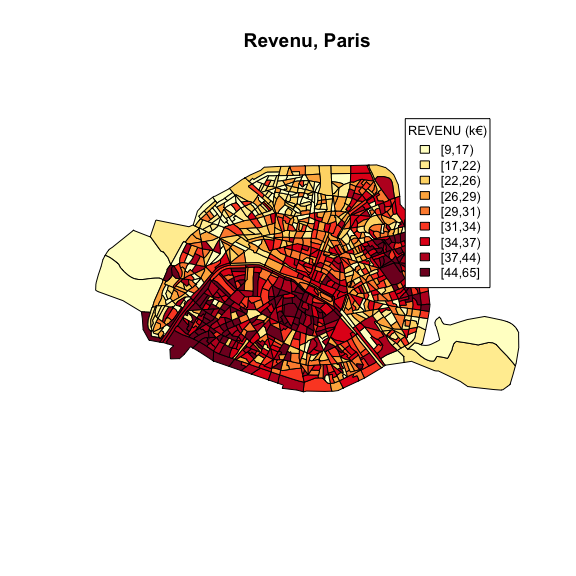<!-- -->

# Régressions

``` r
library(trifield)
library(ineq)
library(sp)
library(compositions)
```

``` r
# Fonctions
simmulti=function(n,p){
  l=length(p)
  L=LETTERS[1:l]
  X=sample(L,size=n,prob=p,replace=TRUE)
  x=as.numeric(table(X)[L])
  x[is.na(x)]=0
  x/sum(x)
}

tripoint=function(s){
  p=s/sum(s)
  p1=c(0,s[2]+s[1]/2,s[3]+s[1]/2)/sum(s)
  p2=c(s[1]+s[2]/2,0,s[3]+s[2]/2)/sum(s)
  p3=c(s[1]+s[3]/2,s[2]+s[3]/2,0)/sum(s)
  C <- abc2xy(matrix(p,1,3))
  C1 <- abc2xy(matrix(p1,1,3))
  C2 <- abc2xy(matrix(p2,1,3))
  C3 <- abc2xy(matrix(p3,1,3))
  return(C)
}
```

``` r
prop=function(X,P){
  mean(point.in.polygon(X[,1],X[,2],P[,1],P[,2])>0)
}
```

## Régression Linéaire sur 1 variable explicative

### Régression OLS standard

``` r
mygreyscale = grey((nrow(base)):0/nrow(base))
plot(base$BEP,base$SUP,col=mygreyscale[rank(base$REVENU)],xlab="BEP",ylab="SUP", asp=1)
polygon(c(0,1,1),c(1,1,0),col="grey",density=20,border=NA)
```

<!-- -->

``` r
reg=lm(REVENU~SUP+BEP,data=base)
u=seq(0,1,by=.01)
p=function(x,y) predict(reg,newdata=data.frame(BEP=x,SUP=y))
z=outer(u,u,p)

plot(base$BEP,base$SUP,col=mygreyscale[rank(base$REVENU)],xlab="BEP",ylab="SUP",xlim=c(.1,.8),ylim=c(.1,.8), asp=1)
image(u,u,z,add=TRUE,col=grey((100:0)/100),breaks=seq(0,70,length=102))
contour(u,u,z,add=TRUE,levels=seq(0,70,by=5))
polygon(c(0,1,1),c(1,1,0),col="white",border=NA)
polygon(c(0,1,1),c(1,1,0),col="grey",density=20,border=NA)
mygreyscale = grey((nrow(base)):0/nrow(base))
points(base$BEP,base$SUP,col=mygreyscale[rev(rank(base$REVENU))])
```

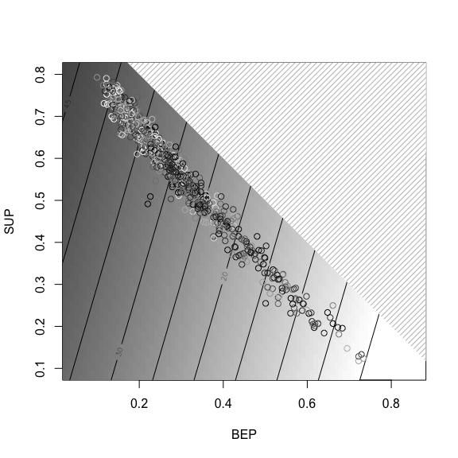<!-- -->

### IRL - sur le simplexe

``` r
ILR=ilr(base[,2:4])
base$ilr1=ILR[,1]
base$ilr2=ILR[,2]
reg <- lm(REVENU~ilr1+ilr2,base)
constante <- coef(reg)[1]
CoefX <- ilrInv(coef(reg)[2:3],origin=base)

orthoComp <- function(x){
  ilrInv(ilr(x) %*% matrix(c(0,1,-1,0),ncol=2))
}

X=acomp(cbind(base$BAC,base$BEP,base$SUP))
revenu=base$REVENU

plot(X,labels=c("BAC","BEP","SUP"),pch=21)
straight(mean(X),CoefX,lty=2,lwd=2)
mY = pretty(revenu,n=10)
refX = mean(X) + ((mY-constante)/norm.acomp(CoefX)^2)*CoefX
plot(refX,add=TRUE,pch=19)
mygreyscale = grey((nrow(refX)):0/nrow(refX))
for(i in 1:nrow(refX)){
  straight(acomp(refX[i,]),orthoComp(CoefX),col=mygreyscale[i],lwd=2)
}
legend("topleft", legend = mY*10000, fill = mygreyscale, cex=0.7, title = "Income",trace=T)
```

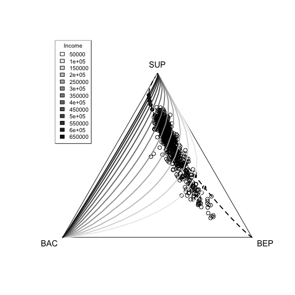<!-- -->

    ##   xchar= 0.02726 ; (yextra, ychar)= 0, 0.03635 
    ##   rect2(-0.04,1.04, w=0.191, h=0.5452, ...)

``` r
ILR=ilr(base[,2:4])
base$ilr1=ILR[,1]
base$ilr2=ILR[,2]
regILR = lm(REVENU~ilr1+ilr2,base)

p2=function(x,y) ifelse((1-x-y)>=0, as.matrix(
                         cbind(1,ilr(cbind(1-x-y,x,y))[,1],
                                 ilr(cbind(1-x-y,x,y))[,2])) %*% coefficients(regILR),NA)
k=257
u=seq(.0001,.9999,length=k)
x=rep(u,k)
y=rep(u,each=k)
p2m=p2(x,y)
p2m[(p2m>71)]=71
p2m[(p2m< (-.5))]=-.50001

z2=matrix(p2m,k,k)
plot(base$BEP,base$SUP,col="white",xlab="BEP",ylab="SUP",
     xlim=c(.1,.8),ylim=c(.1,.8), asp=1)
image(u,u,z2,add=TRUE,col=grey((100:0)/100),breaks=seq(0,70,length=102))
contour(u,u,z2,add=TRUE,levels=seq(0,70,by=5))
polygon(c(0,1,1),c(.99,.99,-.01),col="white",border="white",lwd=2)
polygon(c(0,1,1),c(1,1,0),col="grey",density=20,border=NA)
mygreyscale = grey((nrow(base)):0/nrow(base))
points(base$BEP,base$SUP,col=mygreyscale[rev(rank(base$REVENU))])
```

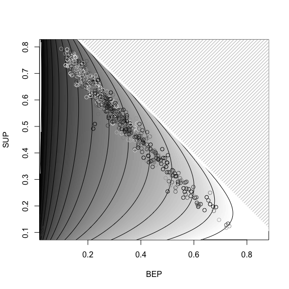<!-- -->

## Regression logarithmique

``` r
reg=lm(log(REVENU)~SUP+BEP,data=base)
u=seq(0,1,length=251)
p1=function(x,y) exp(predict(reg,newdata=data.frame(BEP=x,SUP=y))+.5*summary(reg)$sigma^2)
z1=outer(u,u,p1)
plot(base$BEP,base$SUP,col=mygreyscale[rank(base$REVENU)],xlab="BEP",ylab="SUP",
     xlim=c(.1,.8),ylim=c(.1,.8), asp=1)
image(u,u,z1,add=TRUE,col=grey((100:0)/100),breaks=seq(0,70,length=102))
contour(u,u,z1,add=TRUE,levels=seq(0,70,by=5))
polygon(c(0,1,1),c(1,1,0),col="white",border=NA)
polygon(c(0,1,1),c(1,1,0),col="grey",density=20,border=NA)
mygreyscale = grey((nrow(base)):0/nrow(base))
points(base$BEP,base$SUP,col=mygreyscale[rev(rank(base$REVENU))])
```

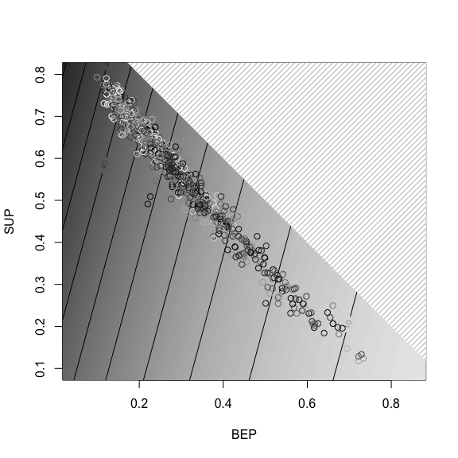<!-- -->

``` r
ILR=ilr(base[,2:4])
base$ilr1=ILR[,1]
base$ilr2=ILR[,2]
regILR = lm(log(REVENU)~ilr1+ilr2,base)

p2=function(x,y) ifelse((1-x-y)>=0, exp(as.matrix(
  cbind(1,ilr(cbind(1-x-y,x,y))[,1],
          ilr(cbind(1-x-y,x,y))[,2])) %*% coefficients(regILR)+.5*summary(regILR)$sigma^2),NA)
k=257
u=seq(.0001,.9999,length=k)
x=rep(u,k)
y=rep(u,each=k)
p2m=p2(x,y)
p2m[(p2m>71)]=71
p2m[(p2m< (-.5))]=-.50001

z2=matrix(p2m,k,k)
plot(base$BEP,base$SUP,col="white",xlab="BEP",ylab="SUP",
     xlim=c(.1,.8),ylim=c(.1,.8), asp=1)
image(u,u,z2,add=TRUE,col=grey((100:0)/100),breaks=seq(-.5,70,length=102))
contour(u,u,z2,add=TRUE,levels=seq(0,70,by=5))
polygon(c(0,1,1),c(.99,.99,-.01),col="white",border="white",lwd=2)
polygon(c(0,1,1),c(1,1,0),col="grey",density=20,border=NA)
mygreyscale = grey((nrow(base)):0/nrow(base))
points(base$BEP,base$SUP,col=mygreyscale[rev(rank(base$REVENU))])
```

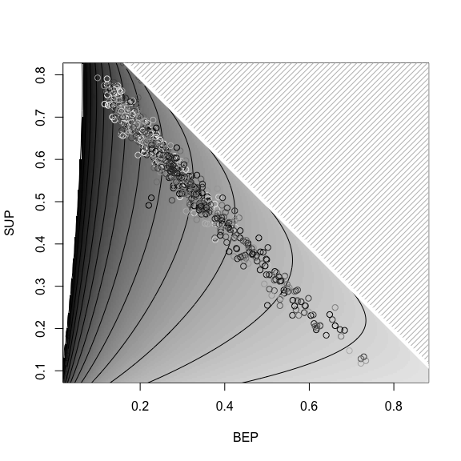<!-- -->

## Régression sur 2 variables explicatives

``` r
base=data.frame(REVENU=p_donnee@data$Mediane/1000,
BEP=p_donnee@data$BEP/(p_donnee@data$BEP+p_donnee@data$BAC+p_donnee@data$SUP),
BAC=p_donnee@data$BAC/(p_donnee@data$BEP+p_donnee@data$BAC+p_donnee@data$SUP),
SUP=p_donnee@data$SUP/(p_donnee@data$BEP+p_donnee@data$BAC+p_donnee@data$SUP),
RP40_100=p_donnee@data$RP40_100/(p_donnee@data$RP40_100+p_donnee@data$RP0_40+p_donnee@data$RP100_plus),
RP0_40=p_donnee@data$RP0_40/(p_donnee@data$RP40_100+p_donnee@data$RP0_40+p_donnee@data$RP100_plus),
RP100_plus=p_donnee@data$RP100_plus/(p_donnee@data$RP40_100+p_donnee@data$RP0_40+p_donnee@data$RP100_plus))
```

``` r
regOLS=lm(REVENU~SUP+BEP+RP0_40+RP100_plus,data=base)
```

``` r
str(base)
```

    ## 'data.frame':    865 obs. of  7 variables:
    ##  $ REVENU    : num  36 36.6 33 36.1 29.2 ...
    ##  $ BEP       : num  0.211 0.184 0.211 0.189 0.278 ...
    ##  $ BAC       : num  0.15 0.135 0.143 0.131 0.139 ...
    ##  $ SUP       : num  0.64 0.681 0.646 0.68 0.583 ...
    ##  $ RP40_100  : num  0.549 0.542 0.409 0.439 0.434 ...
    ##  $ RP0_40    : num  0.319 0.358 0.496 0.372 0.522 ...
    ##  $ RP100_plus: num  0.1315 0.0993 0.0949 0.1893 0.0434 ...

``` r
ILR1=ilr(base[,2:4])
ILR2=ilr(base[,5:7])
base$ilr11=ILR1[,1]
base$ilr12=ILR1[,2]
base$ilr21=ILR2[,1]
base$ilr22=ILR2[,2]
```

``` r
regILR=lm(REVENU~ilr11+ilr12+ilr21+ilr22,base)
summary(regOLS)
```

    ## 
    ## Call:
    ## lm(formula = REVENU ~ SUP + BEP + RP0_40 + RP100_plus, data = base)
    ## 
    ## Residuals:
    ##      Min       1Q   Median       3Q      Max 
    ## -15.5589  -2.3811  -0.0187   2.4848  13.6542 
    ## 
    ## Coefficients:
    ##             Estimate Std. Error t value Pr(>|t|)    
    ## (Intercept)    9.650      4.573   2.110   0.0351 *  
    ## SUP           34.956      5.146   6.793 2.05e-11 ***
    ## BEP           -9.978      5.754  -1.734   0.0832 .  
    ## RP0_40        -6.001      1.096  -5.478 5.65e-08 ***
    ## RP100_plus    51.115      1.499  34.103  < 2e-16 ***
    ## ---
    ## Signif. codes:  0 '***' 0.001 '**' 0.01 '*' 0.05 '.' 0.1 ' ' 1
    ## 
    ## Residual standard error: 3.691 on 860 degrees of freedom
    ## Multiple R-squared:  0.8728, Adjusted R-squared:  0.8722 
    ## F-statistic:  1475 on 4 and 860 DF,  p-value: < 2.2e-16

``` r
summary(regILR)
```

    ## 
    ## Call:
    ## lm(formula = REVENU ~ ilr11 + ilr12 + ilr21 + ilr22, data = base)
    ## 
    ## Residuals:
    ##      Min       1Q   Median       3Q      Max 
    ## -25.3077  -3.0380  -0.2689   2.8861  18.8377 
    ## 
    ## Coefficients:
    ##             Estimate Std. Error t value Pr(>|t|)    
    ## (Intercept)  33.4039     0.9760  34.226  < 2e-16 ***
    ## ilr11         7.0134     0.9669   7.253 9.07e-13 ***
    ## ilr12         9.2400     0.5801  15.929  < 2e-16 ***
    ## ilr21         0.2032     0.4107   0.495    0.621    
    ## ilr22         5.4818     0.2314  23.689  < 2e-16 ***
    ## ---
    ## Signif. codes:  0 '***' 0.001 '**' 0.01 '*' 0.05 '.' 0.1 ' ' 1
    ## 
    ## Residual standard error: 4.744 on 860 degrees of freedom
    ## Multiple R-squared:  0.7898, Adjusted R-squared:  0.7888 
    ## F-statistic: 807.8 on 4 and 860 DF,  p-value: < 2.2e-16

``` r
library(splines)
db = data.frame(y=predict(regOLS),x=base$REVENU)
nl = lm(y~bs(x,12),data=db)
ndb=data.frame(x=seq(9,70,by=.25))
plot(base$REVENU,predict(regOLS),ylim=range(base$REVENU))
abline(a=0,b=1,lty=2)
v=predict(nl,newdata=ndb)
```

    ## Warning in bs(x, degree = 3L, knots = c(`10%` = 16.3608, `20%` = 21.1368, :
    ## some 'x' values beyond boundary knots may cause ill-conditioned bases

``` r
lines(ndb$x,v,lwd=2,col="red")
```

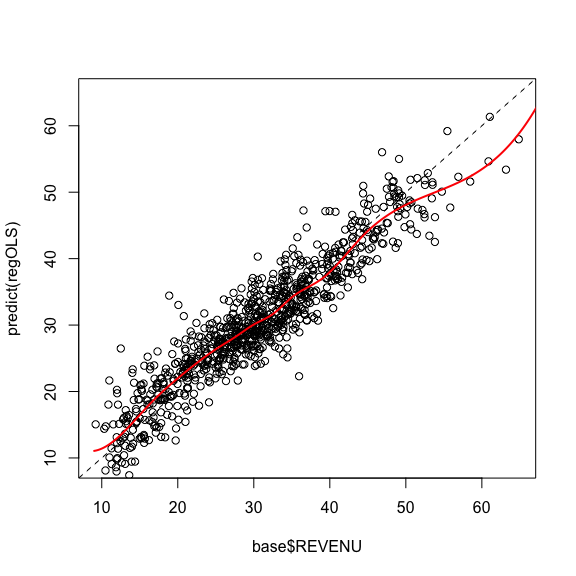<!-- -->

``` r
db = data.frame(y=predict(regILR),x=base$REVENU)
nl = lm(y~bs(x,12),data=db)
ndb=data.frame(x=seq(9,70,by=.25))
plot(base$REVENU,predict(regILR),ylim=range(base$REVENU))
abline(a=0,b=1,lty=2)
lines(ndb$x,predict(nl,newdata=ndb),lwd=2,col="red")
```

    ## Warning in bs(x, degree = 3L, knots = c(`10%` = 16.3608, `20%` = 21.1368, :
    ## some 'x' values beyond boundary knots may cause ill-conditioned bases

``` r
lines(ndb$x,v,col=rgb(1,0,0,.3))
```

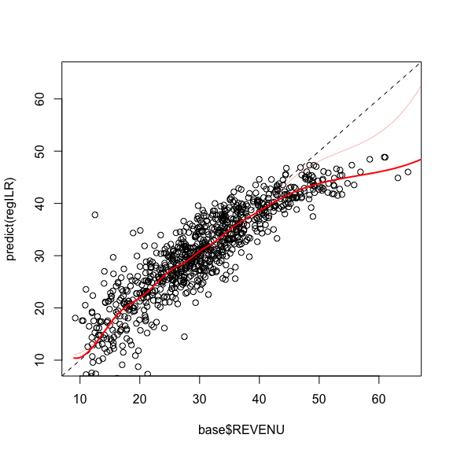<!-- -->

``` r
regILR2=lm(REVENU~ilr11+ilr12+ilr22,base)
summary(regILR2)
```

    ## 
    ## Call:
    ## lm(formula = REVENU ~ ilr11 + ilr12 + ilr22, data = base)
    ## 
    ## Residuals:
    ##      Min       1Q   Median       3Q      Max 
    ## -25.3070  -3.0438  -0.2591   2.8814  18.9614 
    ## 
    ## Coefficients:
    ##             Estimate Std. Error t value Pr(>|t|)    
    ## (Intercept)  33.2125     0.8957  37.080  < 2e-16 ***
    ## ilr11         7.0193     0.9664   7.263 8.46e-13 ***
    ## ilr12         9.3489     0.5364  17.428  < 2e-16 ***
    ## ilr22         5.4513     0.2229  24.452  < 2e-16 ***
    ## ---
    ## Signif. codes:  0 '***' 0.001 '**' 0.01 '*' 0.05 '.' 0.1 ' ' 1
    ## 
    ## Residual standard error: 4.741 on 861 degrees of freedom
    ## Multiple R-squared:  0.7897, Adjusted R-squared:  0.789 
    ## F-statistic:  1078 on 3 and 861 DF,  p-value: < 2.2e-16

# Simulations

``` r
library(compositions)
n=500
X=matrix(rexp(n*3),n,3)
X=X/apply(X,1,sum)
XC=acomp(X)
IX=ilr(XC)
Y=5*IX[,1]+3*IX[,2]+rnorm(n)/5
mygreyscale = grey((nrow(base)):0/nrow(base))
plot(XC,col=mygreyscale[rank(Y)])
```

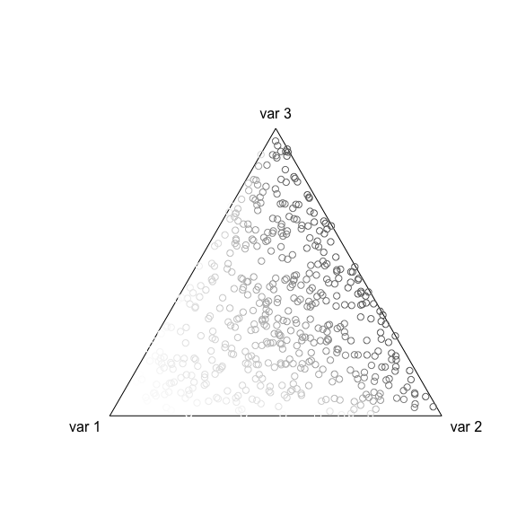<!-- -->

``` r
base=data.frame(Y=Y,X1=X[,1],X2=X[,2],X3=X[,3],ilr1=ilr(XC)[,1],ilr2=ilr(XC)[,2])
reg=lm(Y~X1+X2,data=base)
u=seq(0,1,by=.01)
p=function(x,y) predict(reg,newdata=data.frame(X1=x,X2=y))
z=outer(u,u,p)

regILR = lm(Y~ilr1+ilr2,base)
p2=function(x,y) ifelse((1-x-y)>=0, as.matrix(
  cbind(1,ilr(cbind(1-x-y,x,y))[,1],
        ilr(cbind(1-x-y,x,y))[,2])) %*% coefficients(regILR),NA)
z2=outer(u,u,p2)

image(u,u,z,col=grey((100:0)/100),breaks=seq(min(Y)-1,max(Y)+1,length=102))
contour(u,u,z,add=TRUE,levels=round(seq(min(Y)-1,max(Y)+1,length=10)))
polygon(c(0,1,1),c(1,1,0),col="white",border=NA)
polygon(c(0,1,1),c(1,1,0),col="grey",density=20,border=NA)
```

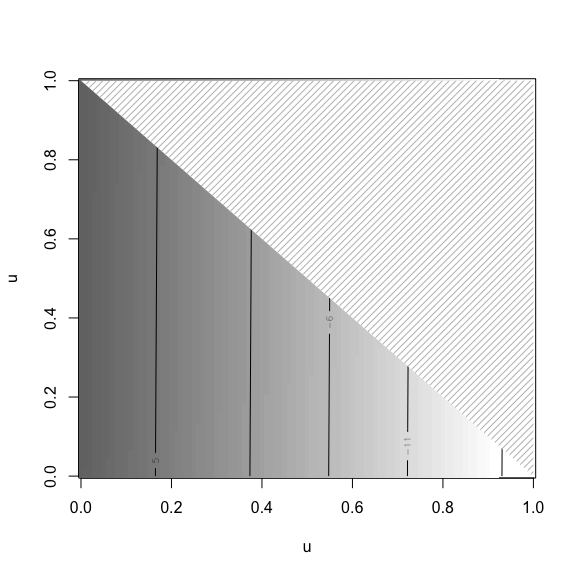<!-- -->

``` r
mygreyscale = grey((nrow(base)):0/nrow(base))
```

``` r
image(u,u,z2,col=grey((100:0)/100),breaks=seq(min(Y)-1,max(Y)+1,length=102))
contour(u,u,z2,add=TRUE,levels=round(seq(min(Y)-1,max(Y)+1,length=10)))
polygon(c(0,1,1),c(1,1,0),col="white",border=NA)
polygon(c(0,1,1),c(1,1,0),col="grey",density=20,border=NA)
```

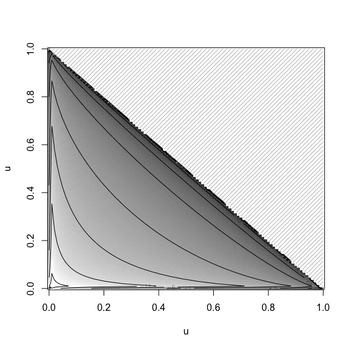<!-- -->

``` r
mygreyscale = grey((nrow(base)):0/nrow(base))
```

``` r
plot(Y,predict(reg))
abline(a=0,b=1,lty=2)
points(Y,predict(regILR),col="red")
```

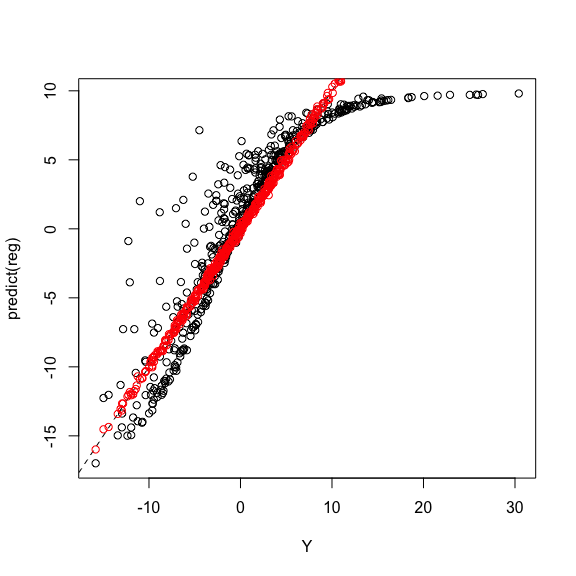<!-- -->
